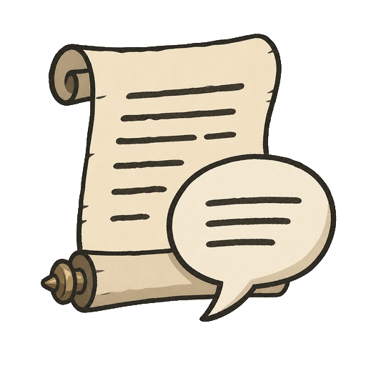

# Cutscene Transcripts

Cutscene Transcripts records dialog boxes shown during cutscenes and displays a small in-game button that opens the transcript.

## Commands

```text
/cutscenetranscript
/cstranscript
```

Use `/cutscenetranscript config` for settings and `/cutscenetranscript clear` to clear the current transcript.
