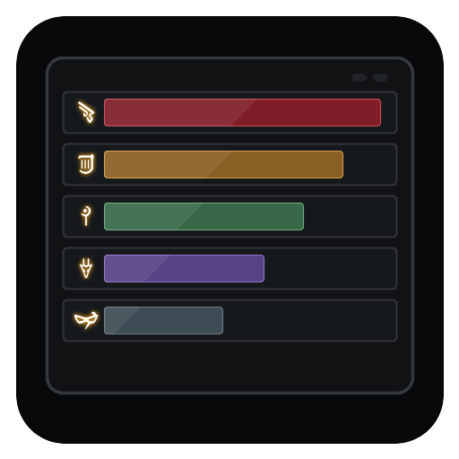

# IINACT Native Overlay

IINACT Native Overlay is a Dalamud plugin that shows IINACT combat data in a native in-game DPS meter.

It does not parse combat logs by itself. IINACT still does the parsing; this plugin connects to IINACT's MiniParse WebSocket stream and renders the meter as a lightweight ImGui overlay inside Final Fantasy XIV. Dalamud IPC is available as a fallback connection method.

## Requirements

- Final Fantasy XIV with Dalamud installed.
- IINACT installed, enabled, and receiving combat data.
- IINACT's WebSocket server enabled. The default address is usually `ws://127.0.0.1:10501`.

## Install

1. Open Dalamud settings in game.
2. Go to `Experimental`.
3. Add this custom plugin repository:

   ```text
   https://raw.githubusercontent.com/J3sven/IINACTNativeOverlay/main/repo.json
   ```

4. Save the repository list.
5. Open the Dalamud Plugin Installer.
6. Search for `IINACT Native Overlay`.
7. Install and enable the plugin.

## Set Up IINACT

1. Install and enable IINACT in Dalamud if you have not already.
2. Open IINACT's settings.
3. Enable the WebSocket server.
4. Keep the server on the default local address unless you have a reason to change it.
5. Enter combat or use a test encounter so IINACT starts sending data.

Once IINACT is running, the overlay should connect automatically. If it does not, run `/iinactoverlay config` and press `Reconnect`.

## Usage

The plugin can be configured via it's settings, or controlled with these chat commands:

- `/iinactoverlay` toggles the meter.
- `/iinactoverlay config` opens settings.
- `/iinactoverlay reconnect` reconnects to IINACT.
- `/iinactoverlay on` shows the meter.
- `/iinactoverlay off` hides the meter.
- `/iinactoverlay lock` locks or unlocks the meter position.
- `/iinactoverlay clickthrough` toggles click-through mode.
- `/iinactoverlay damage`, `/iinactoverlay taken`, and `/iinactoverlay healing` switch meter tabs.
- `/iinactoverlay solo` toggles solo mode.
- `/iinactoverlay merge-pets` toggles pet stat merging.
- `/iinactoverlay privacy` toggles blurred names for other players.
- `/iinactoverlay ws` uses the IINACT WebSocket connection.
- `/iinactoverlay ipc` uses the Dalamud IPC fallback connection.

The settings window also lets you change the row count, opacity, out-of-combat behavior, lock state, click-through mode, connection type, active tab, tab visibility, solo mode, pet merging, name privacy, name abbreviation, and optional stat columns.

## Troubleshooting

If the overlay is visible but shows no combat data:

- Make sure IINACT is installed and enabled.
- Make sure IINACT is receiving combat data.
- Make sure IINACT's WebSocket server is enabled.
- Open `/iinactoverlay config` and check the connection status.
- Press `Reconnect`.
- Try `/iinactoverlay ipc` if the WebSocket connection is unavailable.

If you are using Linux or a tiling window manager, this plugin is intended to avoid the usual problems of external overlay windows by drawing the meter directly inside Dalamud.
